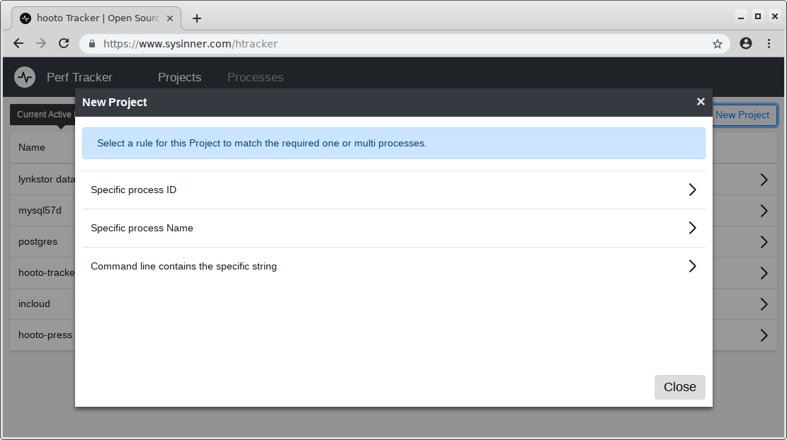
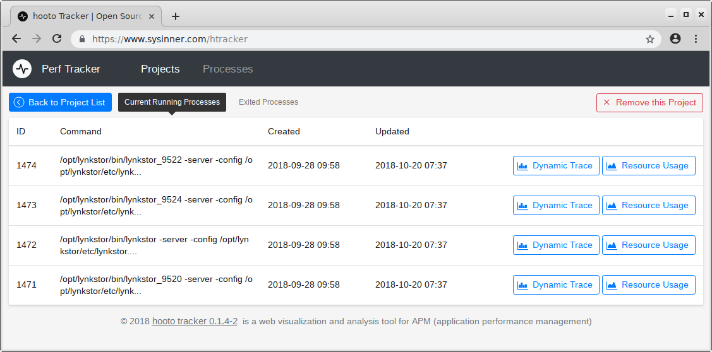
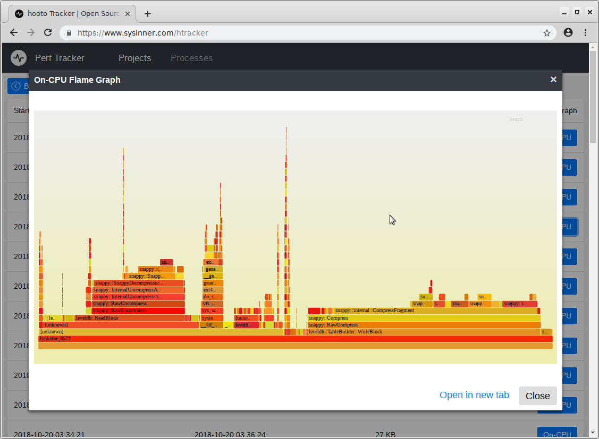
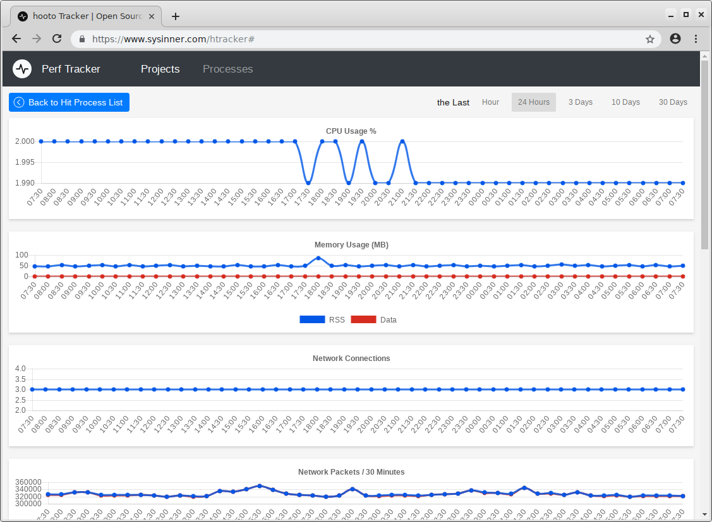
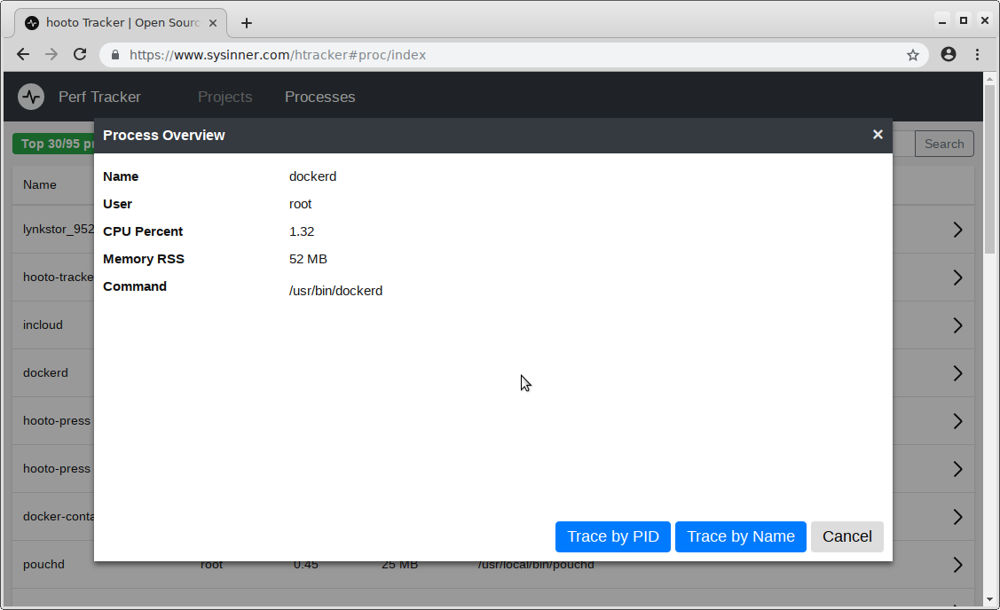

# About

hooto tracker is a web frontend visualization and analysis tool for APM (application performance management).

## Features

* Compatible with Linux systems
* Probe point based on process, no need to modify the analyzed application's code
* Continuous tracking and state saving
* Historical rollup of all data (default setup in 30 days)
* Resource Usage capture and charts (CPU, Memory, Network, IO, ...)
* Dynamic Trace capture and graphs (On-CPU, ...)

# Install

## install from YUM (CentOS 7.x, RHEL 7.x, ...)

### step 1: setup yum repo

``` shell
wget https://www.hooto.com/repo/el/hooto.repo -O /etc/yum.repos.d/hooto.repo
```

### step 2: install with yum
``` shell
yum install -y hooto-tracker

systemctl start hooto-tracker
```


## install from source code

### step 1: install dependency packages

``` shell
# CentOS 7.x
sudo yum install -y perf golang


# Ubuntu 18.04
sudo apt install linux-tools-commom linux-tools-generic golang
```

### step 2: download source code, build, install and start the server

``` shell
# download source code
git clone https://github.com/hooto/htracker.git
cd htracker
git submodule update


# build and install
make
sudo make install

# start server
systemctl start hooto-tracker
```


# Getting Started

you can access the hooto-tracker via **http://127.0.0.1:9520/** with your browser.

> by default, the server running on port 9520, you can change the configuration via /opt/hooto/tracker/etc/config.json, then restart the server `systemctl restart hooto-tracker`

## Online Demo

* Demo Url [https://www.sysinner.com/demo/htracker/](https://www.sysinner.com/demo/htracker/) (Password: 123456)


## Project

Hooto Tracker use **Project** to match and manage the processes that need to be tracked. 

You can choose different matching pattens to match one or multiple processes in creating a New Project

* Process ID
* Process Name
* Process Command line content



### Tips

* Resource Monitoring (CPU, Memory, IO, Net, ...) is collected in real time, until the process exits
* Dynamic Tracing (CPU FlameGraph) is automatically runs in every 20 minutes, 2 minutes each time 



### Example of FlameGraph in Dynamic Tracing


### Example of Resource Monitoring



## Processes (Top N)

Hooto Tracker also create a simple page that list the Top N processes, and you can click on the process to create a New Project with a shortcut way.





# Dependent Projects or Documents

* Brendan Gregg's site for computer performance analysis and methodology [http://www.brendangregg.com/](http://www.brendangregg.com/)
* Stack trace visualizer [https://github.com/brendangregg/FlameGraph](https://github.com/brendangregg/FlameGraph)
* Cross-platform lib for process and system monitoring [https://github.com/shirou/gopsutil](https://github.com/shirou/gopsutil)
* D3.js JavaScript visualization lib [https://d3js.org/](https://d3js.org/)
* D3.js plugin that produces flame graphs [https://github.com/spiermar/d3-flame-graph](https://github.com/spiermar/d3-flame-graph)
* jQuery Web library [http://jquery.com/](http://jquery.com/)
* Bootstrap Web	UI library [http://getbootstrap.com/](http://getbootstrap.com/)

